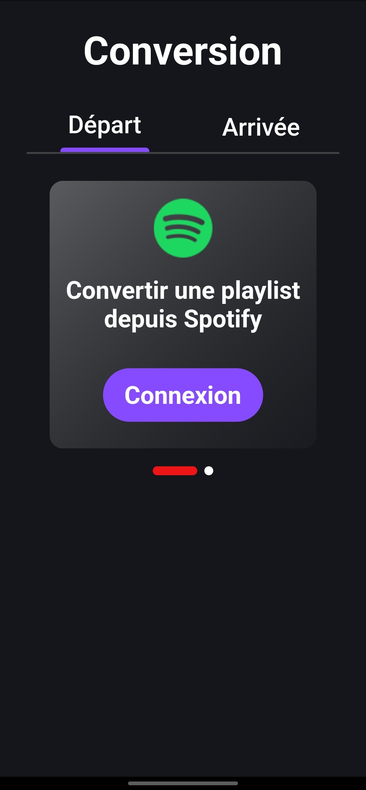
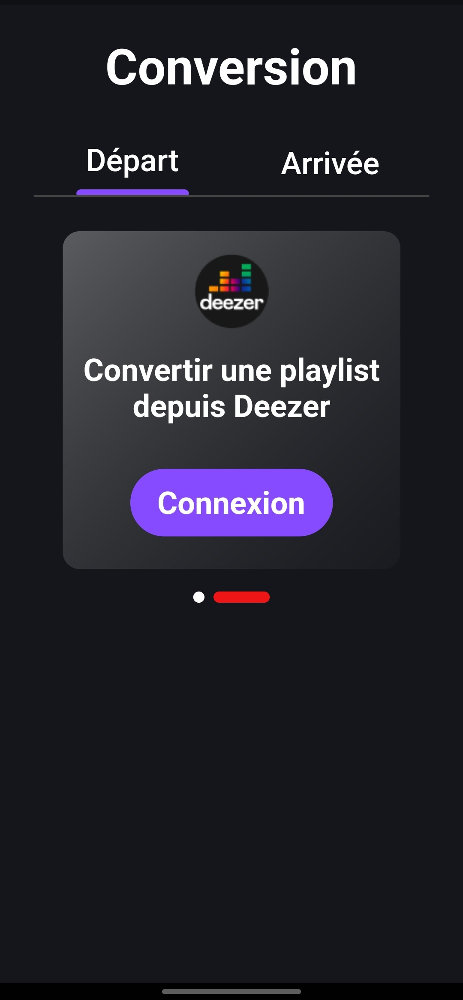
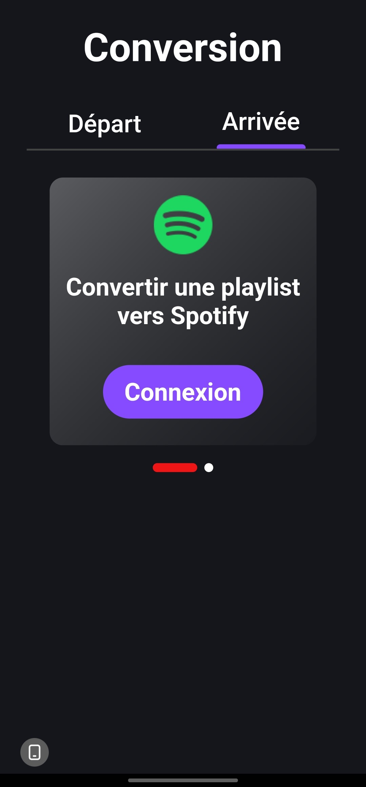
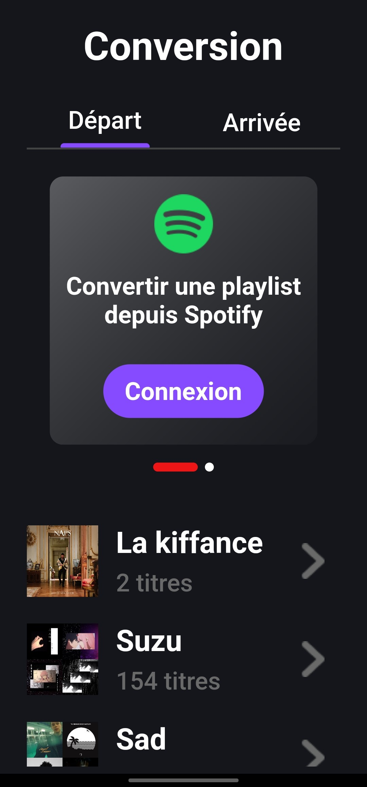

# Convertor

Convertor est une application qui vous permets de convertir des playlist entre les plateformes de
streaming Deezer et Spotify.

## Fonctionnalitées :
- Connection au compte spotify
- Récupération des playlist spotify
- Récupération de toutes les informations de la playlist sélctionnée (durée, image, musiques)

## Futures fonctionnalitées :
- Mêmes fonctionnalitées que Spotify mais pour Deezer (code déjà fonctionnel, reste plus qu'à l'implémenter
dans l'application mobile)

## Images de l'application :

## Langages utilisés :
- Dart
- Flutter
- Java